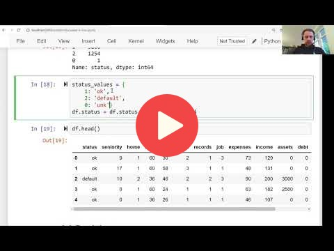

## 6.2 Data cleaning and preparation

<a href="https://www.youtube.com/watch?v=tfuQdI3YO2c&list=PL3MmuxUbc_hIhxl5Ji8t4O6lPAOpHaCLR"></a>

[Slides](https://www.slideshare.net/AlexeyGrigorev/ml-zoomcamp-6-decision-trees-and-ensemble-learning)


## Notes
Mapping status_values as follows:
```
status_values = {
    1: 'ok',
    2: 'default',
    0: 'unk'
}

home_values = {
    1: 'rent',
    2: 'owner',
    3: 'private',
    4: 'ignore',
    5: 'parents',
    6: 'other',
    0: 'unk'
}

df.home = df.home.map(home_values)

marital_values = {
    1: 'single',
    2: 'married',
    3: 'widow',
    4: 'separated',
    5: 'divorced',
    0: 'unk'
}

df.marital = df.marital.map(marital_values)

records_values = {
    1: 'no',
    2: 'yes',
    0: 'unk'
}

df.records = df.records.map(records_values)

job_values = {
    1: 'fixed',
    2: 'partime',
    3: 'freelance',
    4: 'others',
    0: 'unk'
}

df.job = df.job.map(job_values)
```

<table>
   <tr>
      <td>⚠️</td>
      <td>
         The notes are written by the community. <br>
         If you see an error here, please create a PR with a fix.
      </td>
   </tr>
</table>


## Navigation

* [Machine Learning Zoomcamp course](../)
* [Session 6: Decision Trees and Ensemble Learning](./)
* Previous: [Credit risk scoring project](01-credit-risk.md)
* Next: [Decision trees](03-decision-trees.md)