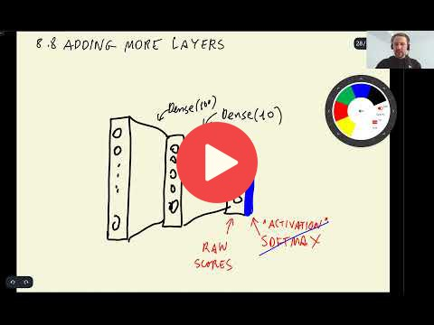

## 8.8 Adding more layers

[Slides](https://www.slideshare.net/AlexeyGrigorev/ml-zoomcamp-8-neural-networks-and-deep-learning-250592316)

## Notes

Add notes from the video (PRs are welcome)
* Adding more layers can be very good for our model, it helps predicting the type of clothes more accurate.
* softmax takes raw scores from a dense layer and transforms it into a probability
* activation functions used for output (sigmoid, softmax) vs activation functions used for intermediate steps(ReLU)
* have a look at http://cs231n.stanford.edu/2017/
* reLU: negativ input --> zero, positive input --> straight line
* Use `nvidia-smi` to see how the gpu is used.
* Adding new layers add complexicity to the model.

<table>
   <tr>
      <td>⚠️</td>
      <td>
         The notes are written by the community.  
         If you see an error here, please create a PR with a fix.
      </td>
   </tr>
</table>

## Navigation

* [Machine Learning Zoomcamp course](../)
* [Session 8: Neural Networks and Deep Learning](./)
* Previous: [Checkpointing](07-checkpointing.md)
* Next: [Regularization and dropout](09-dropout.md)
