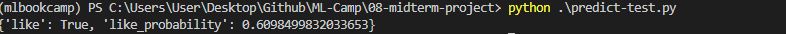

- [Dataset](#dataset)
- [Main Goal](#main-goal)
- [Enviroment](#enviroment)
  - [Create a conda enviroment](#create-a-conda-enviroment)
  - [Activate the conda enviroment](#activate-the-conda-enviroment)
  - [Install Ipykernel](#install-ipykernel)
  - [Install requirements.txt](#install-requirementstxt)
  - [Working on notebook (EDA-train-model evaluation)](#working-on-notebook-eda-train-model-evaluation)
  - [Train script](#train-script)
  - [Predict script](#predict-script)
  - [Testing predict-script.](#testing-predict-script)
    - [Results](#results)
  - [Docker](#docker)
    - [Create a pipenv](#create-a-pipenv)
    - [Activate the pipenv](#activate-the-pipenv)
    - [Install requirements.txt](#install-requirementstxt-1)
    - [Build the docker image](#build-the-docker-image)
    - [Run the docker image](#run-the-docker-image)
    - [Test docker container](#test-docker-container)
- [Model as a Service](#model-as-a-service)
  - [Install streamlit](#install-streamlit)
# Dataset
I've created my own dataset. I've downloaded some music from spotify with the notebook [spotify-notebook](notebooks/spotify_data.ipynb), then I concataned the data.
You can find de data documentation (playlist and artists) in this [notebook](notebooks/notebook.ipynb).
# Main Goal
The main goal of this project is to classified all kind of music and predict if I'd like or not.
# Enviroment
I've created a conda enviroment for this project
## Create a conda enviroment
`conda create -n midterm-project python=3.9`
## Activate the conda enviroment
`conda activate midterm-project`
## Install Ipykernel
`conda install ipykernel`
## Install requirements.txt
`pip install -r requirements.txt`

## Working on notebook (EDA-train-model evaluation)
The EDA, train and model-evaluation is in this [notebook](notebooks/notebook.ipynb).
## Train script
Train script is [here](train.py)

You can run it using the following command: `python train.py`
## Predict script
Predict script is [here](predict.py)

You can run it using the following command: `python predict.py`
## Testing predict-script.
I'll test the script with a random music of the dataset.

Run this (ensure the flask application is running): `python predict-test.py`
### Results

## Docker
I'll create a pipenv for this and use `Pipfile` and `Pipfile.lock` for the docker container.
### Create a pipenv
`pipenv install`
### Activate the pipenv
`pipenv shell`
### Install requirements.txt
`pip install -r requirements.txt`
### Build the docker image
`docker build -t midterm-project .`
### Run the docker image
`docker run -it midterm-project`
### Test docker container
You can use the same `predict-test.py` script to test your docker-container.
# Model as a Service
I'll use streamlit to deploy the model.
## Install streamlit
`pip install streamlit`
