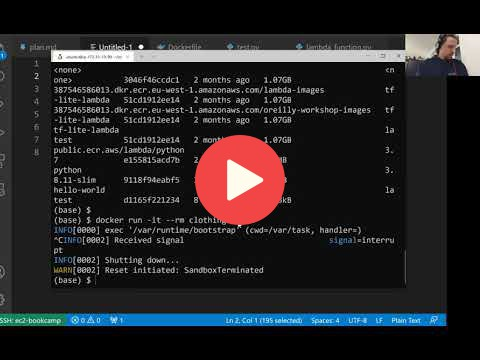

## 9.6 Creating the lambda function

<a href="https://www.youtube.com/watch?v=kBch5oD5BkY&list=PL3MmuxUbc_hIhxl5Ji8t4O6lPAOpHaCLR"></a>
 


## Notes

1. Deploy the docker container on Lambda.
2. First at all, we have to put our container on AWS ECR (Elastic Container Registry)
3. We can use cli to to that
4. Install aws-cli to your computer with `pip install awscli`
5. `aws ecr create-repository --repository-name clothing-tfilite-images`
6. Copy the uri
7. We have to access to ECR before we can publish our image, so we use the following command `aws ecr get-login --no-include-email | sed 's/[0-9a-zA-Z=]\{20,}PASSWORD/g'
8. For instance, you can have something like this:
```
ACCOUNT=38756546546546
REGION=eu-west-1
REGISTRY=clothing-tflite-images
PREFIX=${ACCOUNT}.dkr.ecr.${REGION}.amazonaws.com/${REGISTRY}

TAG=clothing-model-xception-v4:001
REMOTE_URI=${PREFIX}:${TAG}
```
9. Then we can use `echo ${REMOTE_URI}`
10. Tag our docker image, `docker tag clothing-model:latest ${REMOTE_URI}`
11. docker push ${REMOTE_URI}
12. Go to AWS-Lambda
13. Follow the instructions.
<table>
   <tr>
      <td>⚠️</td>
      <td>
         The notes are written by the community. <br>
         If you see an error here, please create a PR with a fix.
      </td>
   </tr>
</table>


## Navigation

* [Machine Learning Zoomcamp course](../)
* [Session 9: Serverless Deep Learning](./)
* Previous: [Preparing a Docker image](05-docker-image.md)
* Next: [API Gateway: exposing the lambda function](07-api-gateway.md)