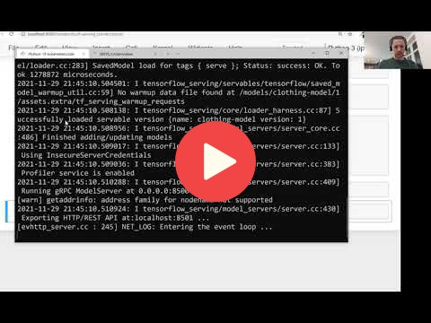

## 10.2 TensorFlow Serving

<a href="https://www.youtube.com/watch?v=deXR2fThYDw&list=PL3MmuxUbc_hIhxl5Ji8t4O6lPAOpHaCLR"></a>
 


## Notes
TensorFlow-Serving has an official Docker image ready for deployment. By using volumes (folders in the host machine that can be mounted to containers in a manner similar to external storage) we can deploy our model in a volume and attach it to a container without the need to rebuild a new image. This is very convenient for developing as it saves a lot of time not having to rebuild images constantly just for trying out different models.


1. Download the model using this link: `wget https://github.com/alexeygrigorev/mlbookcamp-code/releases/download/chapter7-model/xception_v4_large_08_0.894.h5 -O clothing-model-v4.h5`

2. Convert model into SavedModel format:
   1. ipython
      ```      
      import tensorflow as tf
      from tensorflow import keras
      model = keras.models.load_model('./clothing-model-v4.h5')
      tf.saved_model.save(model, 'clothing-model')
      ```
3. Install tree on WSL: `sudo apt install tree`
4. tree clothing-model
5. See the model: saved_model_cli show --dir clothing-model --all
6. serving-default, input_8-input, dense_7-output
7. Run TF in docker:
   ```
   docker run -it --rm \
    -p 8500:8500 \
    -v "$(pwd)/clothing-model:/models/clothing-model/1" \
    -e MODEL_NAME=clothing-model \
    tensorflow/serving:2.3.0
   ```
   Windows:
   ```
   docker run -it --rm `
    -p 8500:8500 `
    -v "C:\Users\User\Desktop\Github\ML-Camp\10-kubernetes\clothing-model:/models/clothing-model/1" `
    -e MODEL_NAME=clothing-model `
    tensorflow/serving:2.3.0
   ```
8. Working on [tf-serving-connect.ipynb](code/tf-serving-connect.ipynb)

<table>
   <tr>
      <td>⚠️</td>
      <td>
         The notes are written by the community. <br>
         If you see an error here, please create a PR with a fix.
      </td>
   </tr>
</table>


## Navigation

* [Machine Learning Zoomcamp course](../)
* [Session 10: Kubernetes and TensorFlow Serving](./)
* Previous: [Overview](01-overview.md)
* Next: [Creating a pre-processing service](03-preprocessing.md)