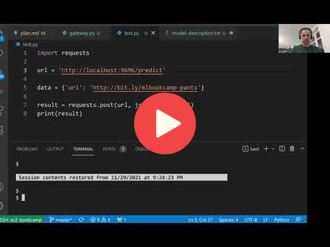

## 10.3 Creating a pre-processing service

<a href="https://www.youtube.com/watch?v=OIlrS14Zi0o&list=PL3MmuxUbc_hIhxl5Ji8t4O6lPAOpHaCLR"></a>
 


## Notes

Creating the pre-processing service (gateway)
* jupyter nbconvert --to script notebook.ipynb

There is one issue: in the notebook we defined the following function:

```python
def np_to_protobuf(data):
    return tf.make_tensor_proto(data, shape=data.shape)
```

The `make_tensor_proto()` method is a TensorFlow method and TensorFlow is a huge library about 2GB in size. A smaller `tensorflow-cpu` library exists but it still is over 400MB in size.

Since we only need to use that particular method, we can instead make use of a separate [`tensorflow-protobuf`](https://github.com/alexeygrigorev/tensorflow-protobuf) package which is available on pip.

```python
!pip install tensorflow-protobuf==2.7.0
```

The [GitHub page for `tensorflow-protobuf`](https://github.com/alexeygrigorev/tensorflow-protobuf) contains info on how to replace the `make_tensor_proto()` method.

Since the additional code is wordy, it would be convenient to define the `np_to_protobuf()` method on a separate `proto.py` script and then import it to the gateway app with `from proto import np_to_protobuf`.

>Summary
* turn jupyter notebook into flask app
* the notebook communicates with the model deployed with tensorflow
* the notebook fetches an image, pre-processes it, turns it into protobuf, sends it to tensorflow-serving, does post-processing and finally gives a human-readable answer
* convert notebook into python script and call the script gateway
* prepare request, send request, prepare response
* you can reuse the flask app code from session 5
* two components: docker container with tensorflow serving and flask application with the gateway
* be aware of the library sizes: tensorflow 1.7 GB, tensorflow CPU ~400 MB, tensorflow serving
* turn numpy array into protobuf format
* tensorflow protobuf

<table>
   <tr>
      <td>⚠️</td>
      <td>
         The notes are written by the community. <br>
         If you see an error here, please create a PR with a fix.
      </td>
   </tr>
</table>


## Navigation

* [Machine Learning Zoomcamp course](../)
* [Session 10: Kubernetes and TensorFlow Serving](./)
* Previous: [TensorFlow Serving](02-tensorflow-serving.md)
* Next: [Running everything locally with Docker-compose](04-docker-compose.md)
