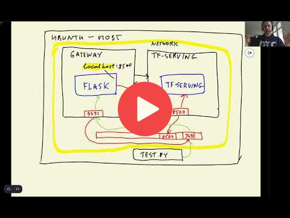

## 10.4 Running everything locally with Docker-compose

<a href="https://www.youtube.com/watch?v=ZhQQfpWfkKY&list=PL3MmuxUbc_hIhxl5Ji8t4O6lPAOpHaCLR"></a>
 

[Slides](https://www.slideshare.net/AlexeyGrigorev/ml-zoomcamp-10-kubernetes)


## Notes

Create [image-gateway.dockerfile](code/image-gateway.dockerfile) and 
[image-model.dockerfile](code/image-model.dockerfile) files.


Build a docker image:
```
docker build -t zoomcamp-10-model:xception-v4-001 -f image-model.dockerfile .
docker build -t zoomcamp-10-gateway:001 -f image-gateway.dockerfile .
```
For run the containers:
```
docker run -it --rm `
   -p 8500:8500 `
   zoomcamp-10-model:xception-v4-001

docker run -it --rm `
   -p 9696:9696 `
   zoomcamp-10-gateway:001
```
Test the containers with [test.py](code/test.py)
It's not working because we need a network.

Create [docker-compose.yml](code/docker-compose.yml) file.

Run the containers with docker-compose:
```
docker-compose up
```

<table>
   <tr>
      <td>⚠️</td>
      <td>
         The notes are written by the community. <br>
         If you see an error here, please create a PR with a fix.
      </td>
   </tr>
</table>


## Navigation

* [Machine Learning Zoomcamp course](../)
* [Session 10: Kubernetes and TensorFlow Serving](./)
* Previous: [Creating a pre-processing service](03-preprocessing.md)
* Next: [Introduction to Kubernetes](05-kubernetes-intro.md)