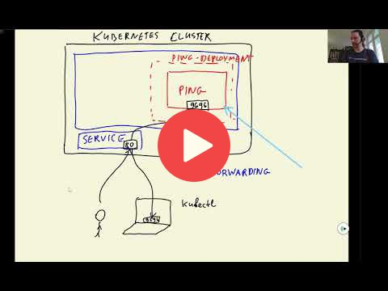
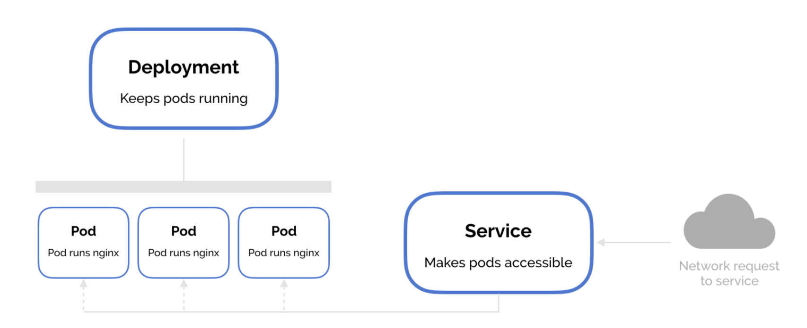

## 10.7 Deploying TensorFlow models to Kubernetes

<a href="https://www.youtube.com/watch?v=6vHLMdnjO2w&list=PL3MmuxUbc_hIhxl5Ji8t4O6lPAOpHaCLR"></a>


## Notes

1. `mkdir kube-config`
2. Create model-deployment.yaml
3. `kind load docker-image zoomcamp-10-model:xception-v4-001`
4. `kubectl apply -f model-deployment.yaml`
5. Delete a deployment, `kubectl delete -f ../ping/deployment.yaml`
6. Forward it, `kubectl port-forward $(kubectl get pod) 8500:8500` (tf-serving-clothing-model-85cd8b89f7-qsjn6)
7. Test it with [gateway.py](code/gateway.py)
8. Create model-service.yaml
9. `kubectl apply -f model-service.yaml` (applying it)
10. `kubectl get svc` (to see it)
11. Port-forward it, `kubectl port-forward service/tf-serving-clothing-model 8500:8500`
12. Test it with [gateway.py](code/gateway.py)
13. gateway-deployment
14. Making gateway-image visible with `kind load docker-image zoomcamp-10-gateway:001`
15. Try to access from one of the pods and put some commands there:
   ```
   tf-serving-clothing-model-85cd8b89f7-qsjn6 (kubectl get pod)

   kubectl exec -it tf-serving-clothing-model-85cd8b89f7-qsjn6 -- bash
   ```
   where: -- means that anything after two minuses is a part of the command that we want to execute.
16. Now we can try to access to gateway-deployment, install curl with `apt update` and `apt install curl`, then `curl localhost:9696/ping`
17. Another example, `apt install telnet` and `telnet tf-serving-clothing-model.default.svc.cluster.local 8500`
18. If all is working, you'll be able to apply gateway-deployment with `kubectl apply -f gateway-deployment.yaml`
19. `kubectl get pod` and make sure that all is working as intended.
20. Forward it with `kubectl port-forward gateway-5857ddf988-mjf46 9696:9696`, test it with `test.py`
21. Create gateway-service
22. Apply it with `kubectl apply -f gateway-service.yaml`
23. Port forward it with `kubectl port-forward service/gateway 8080:80`
24. Test it with `test.py`


* tensorflow serving in C++, gateway service as flask app
* gateway service: image preprocessing (i.e. resizing), prepare matrix, numpy arr, convert to protobuf, gRPC to communicate with tensorflow serving; postprocessing
* using telnet to check kubernetes pod

<table>
   <tr>
      <td>⚠️</td>
      <td>
         The notes are written by the community. <br>
         If you see an error here, please create a PR with a fix.
      </td>
   </tr>
</table>


## Navigation

* [Machine Learning Zoomcamp course](../)
* [Session 10: Kubernetes and TensorFlow Serving](./)
* Previous: [Deploying a simple service to Kubernetes](06-kubernetes-simple-service.md)
* Next: [Deploying to EKS](08-eks.md)
